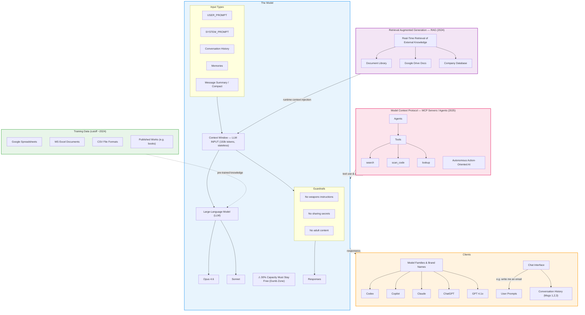

# LLM Understanding

> **Module 1 — The Mainline**
>
> This is the foundational lesson. Understand the LLM system in full before moving on to clients, models, or providers.

---

## LLM System Context Diagram

The diagram below shows all the major components of a modern LLM system and how they connect.



---

## The Model

This section represents the **core LLM architecture** and its components.

The model includes a **Context Window** that manages the LLM INPUT (150k tokens) in a stateless manner. Within this system sits The Large-Language Model (LLM) itself, with specific implementations like **Opus 4.6** and **Sonnet**.

!!! warning "The Dumb Zone"
    A critical operational note: **30% of capacity should remain free** at all times to avoid the "Dumb Zone" — the point at which the model's performance degrades because the context window is too full to reason effectively.

The model processes several key **input types**:

| Input Type | Description |
|---|---|
| `USER_PROMPT` | The message the user typed |
| `SYSTEM_PROMPT` | Instructions from the application/developer |
| `Conversation History` | Messages 1, 2, 3… the running dialogue |
| `Memories` | Persistent facts saved across sessions |
| `Message Summary / Compact` | A compressed version of earlier conversation (`/compact`) |

**Guardrails** are built in to enforce safety rules:

- 🚫 Don't teach people how to make weapons
- 🔒 Don't share secrets or private data
- 🔞 Don't produce adult content

The system generates **Responses** that flow back to users through the chat interface.

---

## Clients

This group shows the various **client products and interfaces** that connect to LLM systems.

It includes Model Family categories, Brand Names, and specific Products like:

- **Codex** — GitHub Copilot's code model
- **Copilot** — Microsoft's AI coding assistant
- **Claude** — Anthropic's assistant (Claude, Opus, Sonnet, Haiku)
- **ChatGPT** — OpenAI's consumer chat product
- **GPT 4.1o** — OpenAI's multimodal model

The **Chat Interface** serves as the interaction layer where users submit prompts (like *"write me an email"* or *"Find Problems in my Sheet"*) and receive responses. Conversation History (Messages 1, 2, 3) is maintained within this client context.

---

## Training Data

This section covers the **foundational knowledge base** that LLMs are built upon.

Training data includes:

- Every Google Spreadsheet and MS Excel document written up to the training data cutoff date
- CSV file formats
- Published works, books, articles, and web content

!!! info "Training Cutoff"
    The training data has a **cutoff date (~2024)**. The model does not automatically know about events after that date unless you provide the information in your prompt or through RAG (see below).

---

## Retrieval Augmented Generation (RAG)

RAG represents the **2024-era approach** to extending LLM capabilities beyond static training data.

This system connects to external knowledge sources at query time, including:

- Document Library
- Google Drive Docs
- Company Database

It enables the LLM to answer questions about *your* documents by retrieving relevant information in **real-time** rather than relying solely on training data.

```
User asks → LLM identifies relevant docs → RAG retrieves content → LLM answers with fresh data
```

---

## Model Context Protocol "MCP Servers" / Agents (2025)

This represents the **next evolution**, marked as 2025 technology.

It introduces **Agents** that can use **Tools** like:

| Tool | Example Use |
|---|---|
| `search` | Query the web or internal systems |
| `scan_code` | Analyse a codebase for bugs or patterns |
| `lookup` | Retrieve structured data from APIs or databases |

This architecture represents a shift toward more **autonomous, action-oriented AI systems** that can interact with external systems and perform complex tasks through tool use — rather than just generating text responses.

---

!!! success "Next Up"
    Continue to [LLM Clients →](../llm-clients/index.md) to learn about the products and interfaces built on top of LLM systems.
